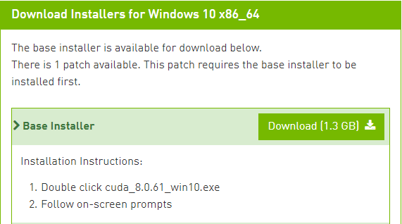

# 설치하기

## Python 설치하기

직관적이고 간결한 문법과 다수의 인공지능 API를 보유하고 있는 파이썬을 설치해봅시다. Python 2.7 버전을 사용할 거예요.



윈도우용 파이썬은 [https://www.python.org/downloads/windows/](https://www.python.org/downloads/windows/) 웹 사이트에서 다운로드 할 수 있습니다. "Latest Python 2 Release - Python 2.x.x" 링크를 클릭하세요.  64 비트일 경우 Windows x86-64 MSI installer를 다운로드하고, 32비트일 경우  Windows x86 MSI installer를 다운로드하세요. 다운받은 설치 프로그램을 실행하고 다음 지시를 따르세요.

> **Note** 설치 중 아래 사진과 같은 창이 나타나면 "Add python.exe to Path"의 왼쪽 버튼을 클릭하고 "Will be installed on local hard drive"를 선택하세요.


설치가 완료되었는지 확인하려면 콘솔에서 다음 명령을 입력하세요.

```text
> python --version
Python 2.x.x
```



Linux 환경은 기본적으로 Python이 설치되어 있습니다. 설치된 버전을 확인하려면 콘솔에서 다음 명령을 입력하세요.

```text
$ python --version
python 3.6.5
```



## Anaconda 설치하기

텐서플로우 설치 전, 개발 환경을 깔끔하게 관리해주는 도구를 설치해봅시다. 가상 환경\(Virtual environment\)은 독립된 개발 환경을 구성할 수 있도록 도와줍니다. 본 프로젝트는 이러한 가상 환경을 만들어 주는 다양한 도구 중 아나콘다를 사용할 것입니다.



윈도우용 아나콘다는 [https://www.anaconda.com/download/\#windows](https://www.anaconda.com/download/#windows) 웹사이트에서 다운로드 할 수 있습니다. 32-Bit인지 또는 64-Bit인지 확인하고 Python 2.7 version을 다운로드 하세요. 다운받은 설치 프로그램을 실행하여 설치를 완료하세요.

설치가 완료되었는지 확인하려면 Anaconda Prompt를 실행하고 다음 명령어를 입력하세요.

```text
(base) > conda --version
conda x.x.x
```



리눅스용 아나콘다는 [https://www.anaconda.com/download/\#linux](https://www.anaconda.com/download/#linux) 웹사이트에서 다운로드 할 수 있습니다. 32-Bit인지 또는 64-Bit인지 확인하고 Python 2.7 version을 다운로드 하세요.

아나콘다를 다운 받은 위치에서 다음 명령을 입력하세요. \(다운 받은 버전에 따라 파일명이 다를 수 있습니다.\)

```text
$ bash Anaconda2-x.x.x-Linux-x86_64.sh
```

> **Note** 설치 시 다음 메시지가 나오면 지시사항에 따르세요.

* 라이센스에 동의하기 위해 yes 입력

```text
Do you accept the license terms? [yes|no]
>>> yes
```

* 기본 위치에 설치하려면 Enter

```text
Anaconda2 will now be installed into this location: (생략)
 >>> (Enter)
```

*  PATH 설정을 위해 yes 입력

```text
Do you with the installer to prepend the Anaconda2 install location to PATH in your /home/(...)/.bashrc ? [yes|no]
>>> yes
```

설치가 완료되었습니다. 설정된 PATH 환경변수를 로딩하기 위해 다음 명령어를 입력하세요.

```text
$ source ~/.bashrc
```

설치된 아나콘다 버전을 확인하려면 다음 명령어를 입력하세요.

```text
$ conda --version
conda x.x.x
```



## Tensorflow-gpu 설치하기

### Anaconda 가상환경 설정

앞서 개발 환경 관리를 위해 설치했던 아나콘다를 이용하여 가상 환경을 만들어 봅시다. 콘솔 창에서 다음 명령어를 입력하세요. py27은 생성하고자 하는 가상환경의 이름입니다.

```text
$ conda create -n py27
```

가상 환경 생성이 완료되면 다음 명령어를 입력하여 가상환경을 활성화할 수 있습니다.

```text
$ source activate py27
```

> **Note** 가상 환경을 종료하고 싶다면 다음 명령어를 입력하세요.

```text
$ source deactivate
```

> **Note** 가상 환경에 설치된 패키지 리스트를 확인하고 싶다면 다음 명령어를 입력하세요.

```text
$ conda list # 가상 환경 활성화 시
$ conda list -n py27 # 가상 환경 비활성화 시
```


### CUDA Toolkit 설치

텐서플로우 GPU 버전을 사용하기 위해서는 CUDA를 설치해야 합니다. [https://developer.nvidia.com/cuda-80-ga2-download-archive](https://developer.nvidia.com/cuda-80-ga2-download-archive) 웹 사이트에서 CUDA Toolkit 8.0 버전을 다운로드하세요.



> **Note** 자신의 환경에 맞는 옵션을 선택합니다.


> **Note** 모든 옵션을 선택하면 아래와 같은 창을 볼 수 있습니다. Base Installer를 다운로드 하세요.





> **Note** 자신의 환경에 맞는 옵션을 선택합니다.


> **Note** 모든 옵션을 선택하면 아래와 같은 창을 볼 수 있습니다. Base Installer를 다운로드 하세요.


CUDA Toolkit을를 다운 받은 위치에서 다음 명령을 입력하세요. \(다운 받은 버전에 따라 파일명이 다를 수 있습니다.\)

```text
$ sudo sh cuda_8.0.61_375.26_linux.run
```

> **Note** 명령어 입력 후, 라이선스 문구를 건너 뛰려면 `ctrl + c`를 입력하세요. 이후 메시지에 대해서는 다음 지시사항에 따르세요.

```text
# accept 입력
Do you accept the previously read EULA?
accpt/decline/quit: accept

# n 입력
Install NVIDIA Accelerated Graphics Driver for Linux-x86_64 375.26?
(y)es/(n)o/(q)uit: n

# y 입력
Install the CUDA 8.0 Toolkit?
(y)es/(n)o/(q)uit: y

# Enter
Enter Toolkit Location
 [ default is /usr/local/cuda-8.0 ]:

# y 입력
Do you want to install a symbolic link at /usr/local/cuda?
(y)es/(n)o/(q)uit: y

# n 입력
Install the CUDA 8.0 Samples?
(y)es/(n)o/(q)uit: n

# Enter
Enter CUDA Samples Location
 [ default is /home/your_id ]:
```




### CuDNN 설치


### Tensorflow-GPU 설치


## Jupyter Notebook 설치하기

주피터 노트북은 라이브 코드, 방정식, 시각화 및 네러티브 텍스트가 포함된 문서를 만들고 공유할 수 있는 오픈 소스 웹 응용 프로그램입니다. 데이터 정리 및 변환, 수치 시뮬레이션, 통계 모델링, 데이터 시각화, 기계 학습 등 다양한 분야에서 사용할 수 있는 도구랍니다.

아나콘다를 설치했다면 주피터 노트북이 함께 설치되어 있을 거예요.

주피터 노트북을 실행하려면 콘솔에서 다음 명령어를 입력하세요. \(윈도우의 경우 Anaconda Prompt에서 입력\)

```text
jupyter notebook
```

